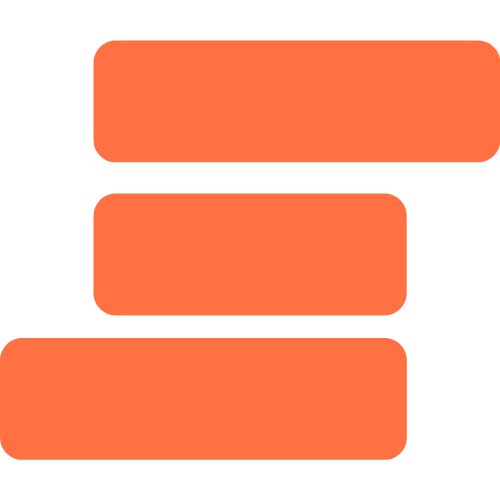

  

<h1 align="center">Slater Notes</h1>

  
  
  

A secure, end-to-end encrypted notes app 🔏 — <a href="https://slaternotes.com">https://slaternotes.com</a>

> **NOTE:** Slater Notes is still a pre-release project (v0.x.x). Please use at your own risk. If you find this project useful, please consider leaving a star so others can find it. Thanks!

> **Help is welcome!** See [CONTIBUTING](#Contributing) for more information.

## Features

- 🔐 Notes and any metadata are 100% end-to-end encrypted
- 🏖 Offline mode
- ☁️ Zero trust cloud sync (_self-hosted cloud sync coming soon!_)
- 🙅‍♂️ No telemetry/analytics/data collection
- 🌙 _Dark mode coming soon!_

## Changelog

`// TODO`

## Maintainers

- Jeff Bocala — [@jeffbocala](https://twitter.com/jeffbocala), [https://jeffbocala.com](https://jeffbocala.com)

## Contributing

`// TODO`

## License

This project is licensed under the terms of the **MIT** license.
